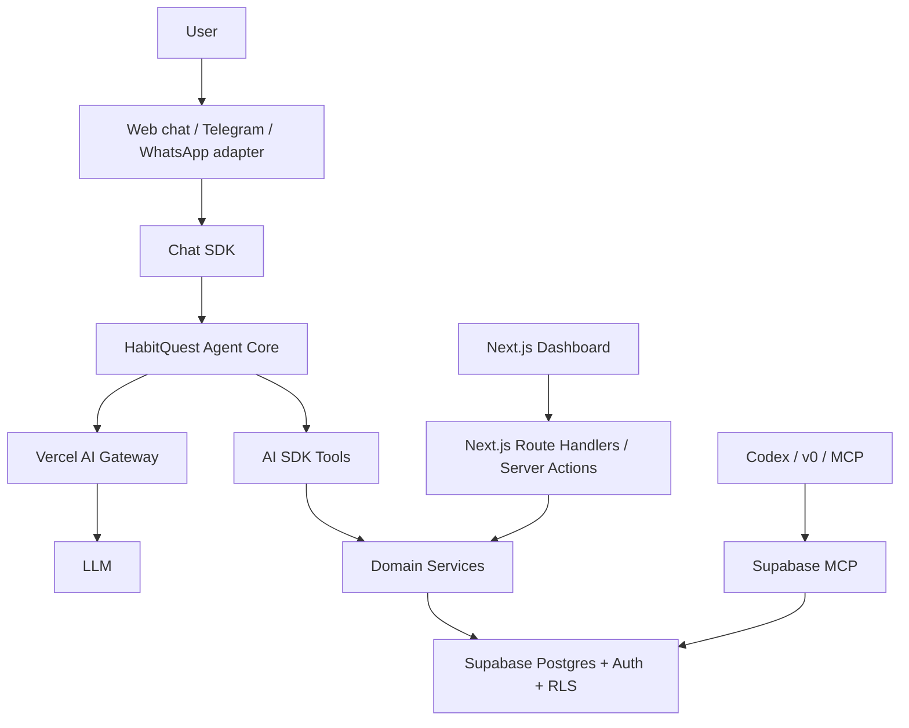
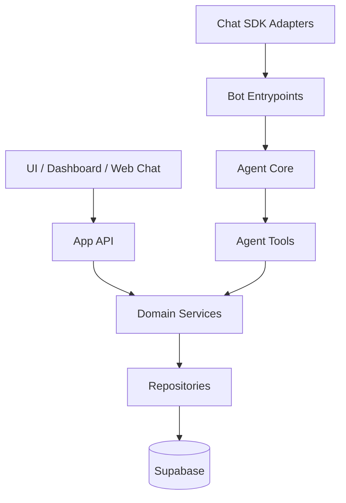

# HabitQuest - Architecture

## Main architecture decision

HabitQuest is conversation-first. The agent is the product. The dashboard is a companion view over the same domain.

The agent must not depend on Telegram, WhatsApp, or web. Channels are adapters. Shared logic lives in the agent core.

## High-level diagram



## Proposed stack

### Frontend

- Next.js App Router.
- React.
- Existing shadcn/ui components.
- v0 for fast visual iteration.
- Dashboard as domain client, not source of truth.

### Backend

- Next.js Route Handlers and/or Server Actions.
- Supabase Auth for simple identity.
- Supabase Postgres for persistence.
- Row Level Security to isolate data by user.

### AI

- Vercel AI SDK through Vercel AI Gateway.
- Agent core with tool calling.
- Structured output with Zod for plans, check-ins, and operational responses.
- Tools with `inputSchema` and `outputSchema`.

### Multichannel chat

- Vercel Chat SDK to abstract adapters.
- Adapter entrypoints for web, Telegram, WhatsApp, or later channels.
- Conversation state linked through `ConversationThread`.

### MCP

- Supabase MCP for development, inspection, and type/schema assistance.
- MCP should not be required for the user-facing runtime.
- Runtime uses explicit domain tools and Supabase services.

## Internal layers



### Agent Core

Responsible for:

- interpreting intent;
- deciding when to use tools;
- answering as a collaborative coach;
- keeping responsible wellbeing framing;
- avoiding medical promises.

### Agent Tools

Responsible for real actions:

- onboarding;
- daily plan generation;
- check-ins;
- completions;
- rewards;
- daily summary.

The agent should not write directly to the database. It must go through tools and domain services.

### Domain Services

Responsible for business rules:

- point calculation;
- reward eligibility;
- plan creation and adaptation;
- ownership validation;
- transactional persistence.

### Repositories

Responsible for Supabase access.

## Minimum API routes

### POST `/api/chat`

Web chat using AI SDK. Receives UI messages and streams agent responses.

### POST `/api/bot/[adapter]`

Entrypoint for Chat SDK adapters. Converts external events into normalized messages for the Agent Core.

### GET `/api/today`

Returns daily summary:

- active plan;
- completions;
- earned points;
- spent points;
- available points;
- available rewards.

### POST `/api/plans/today`

Creates or adapts today's plan.

## Supabase and security

- Use Supabase Auth as identity source.
- Tables with `profile_id` must use RLS by authenticated user.
- Service role only server-side and only when necessary.
- Never expose service role to the browser.
- Dashboard must not rely on Zustand as the persistent source of truth.

## Environment variables

```env
NEXT_PUBLIC_SUPABASE_URL=
NEXT_PUBLIC_SUPABASE_ANON_KEY=
SUPABASE_SERVICE_ROLE_KEY=
V0_API_KEY=
TELEGRAM_BOT_TOKEN=
WHATSAPP_ACCESS_TOKEN=
WHATSAPP_VERIFY_TOKEN=
```

For AI Gateway on Vercel, prefer Vercel-managed OIDC/env configuration when the project is linked.

## Hackathon decisions

- Prioritize a functional demo over enterprise architecture.
- Start with simple Supabase Auth.
- Use personal rewards, not real partners.
- Keep Chat SDK ready for adapters even if the demo starts with web chat.
- Do not add automatic morning scheduling in the first MVP slice.

## Risks

| Risk | Mitigation |
| --- | --- |
| Scope gets too large | Work through small issues and keep a closed demo script |
| Adapter setup takes too long | Keep web chat as fallback |
| Copy sounds medical | Use behavioral wellbeing and clear disclaimers |
| RLS delays implementation | Start with simple schema and minimum policies |
| Agent tools mix with UI | Separate Agent Core, Domain Services, and Repositories |
