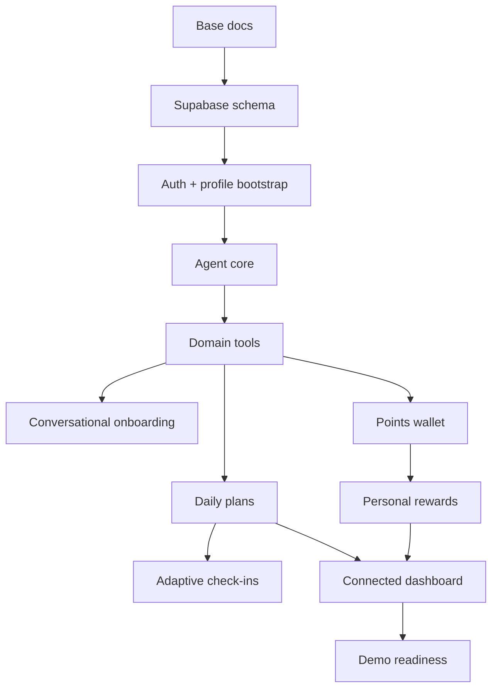

# HabitQuest - Backlog MVP

## Goal

This backlog organizes the work for a HabitQuest hackathon demo. The priority is to demonstrate the main loop:

**conversational onboarding -> daily plan -> check-ins -> completions -> wallet -> rewards -> dashboard**

## Recommended execution order

1. Base documentation.
2. Supabase schema + Auth.
3. Domain services.
4. Agent core + tools.
5. Web chat.
6. Product loop.
7. Dashboard connected to real data.
8. Demo script and tests.

## GitHub

- Repo: <https://github.com/tomiloki/VercelHack>
- Milestone: [Hackathon MVP](https://github.com/tomiloki/VercelHack/milestone/1)

## Created issues

### Epic 0 - Documentation and organization

| # | Issue | Label | Dependencies | Acceptance criterion |
| --- | --- | --- | --- | --- |
| [#1](https://github.com/tomiloki/VercelHack/issues/1) | `docs(product): define HabitQuest product vision` | documentation | None | `docs/product.md` describes problem, user, value proposition, and responsible limits. |
| [#2](https://github.com/tomiloki/VercelHack/issues/2) | `docs(modeling): define domain model and business rules` | documentation | None | `docs/domain-model.md` defines main entities and rules. |
| [#3](https://github.com/tomiloki/VercelHack/issues/3) | `docs(architecture): document Vercel AI architecture` | documentation | None | `docs/architecture.md` explains stack, layers, and flow. |
| [#4](https://github.com/tomiloki/VercelHack/issues/4) | `docs(backlog): define MVP epics and execution order` | documentation | Previous docs issues | `docs/backlog.md` lists epics, dependencies, and criteria. |

### Epic 1 - Foundation

| # | Issue | Label | Dependencies | Acceptance criterion |
| --- | --- | --- | --- | --- |
| [#5](https://github.com/tomiloki/VercelHack/issues/5) | `feat(data): add Supabase schema for HabitQuest` | enhancement | Domain model | Migration includes base tables, keys, and initial RLS. |
| [#6](https://github.com/tomiloki/VercelHack/issues/6) | `feat(auth): add Supabase Auth and profile bootstrap` | enhancement | Schema | Simple login and automatic profile bootstrap work. |
| [#7](https://github.com/tomiloki/VercelHack/issues/7) | `chore(env): document required environment variables` | documentation | Architecture | `.env.example` and docs explain required variables. |

### Epic 2 - Agent Core

| # | Issue | Label | Dependencies | Acceptance criterion |
| --- | --- | --- | --- | --- |
| [#8](https://github.com/tomiloki/VercelHack/issues/8) | `feat(ai): implement HabitQuest agent core` | enhancement | Foundation | Agent responds as collaborative coach and uses responsible framing. |
| [#9](https://github.com/tomiloki/VercelHack/issues/9) | `feat(ai): add domain tools for planning and tracking` | enhancement | Agent core, domain services | Typed Zod tools execute real actions. |
| [#10](https://github.com/tomiloki/VercelHack/issues/10) | `feat(chat): add web chat experience` | enhancement | Agent core | Web chat allows the user to talk with the agent. |
| [#11](https://github.com/tomiloki/VercelHack/issues/11) | `feat(bot): add Chat SDK adapter entrypoint` | enhancement | Agent core | Multichannel entrypoint normalizes events into the core. |

### Epic 3 - Product Loop

| # | Issue | Label | Dependencies | Acceptance criterion |
| --- | --- | --- | --- | --- |
| [#12](https://github.com/tomiloki/VercelHack/issues/12) | `feat(onboarding): replace static onboarding with conversational onboarding` | enhancement | Agent tools | Agent captures goals, activities, avoidances, and rewards. |
| [#13](https://github.com/tomiloki/VercelHack/issues/13) | `feat(plans): generate daily plans without fixed schedules` | enhancement | Agent tools | Plan has duration and suggested order, no fixed schedules. |
| [#14](https://github.com/tomiloki/VercelHack/issues/14) | `feat(checkins): adapt daily plan from user check-ins` | enhancement | Daily plan | Check-ins can adjust plan or record state. |
| [#15](https://github.com/tomiloki/VercelHack/issues/15) | `feat(wallet): implement flexible points wallet` | enhancement | Schema, completions | Wallet calculates earned, spent, and available points. |
| [#16](https://github.com/tomiloki/VercelHack/issues/16) | `feat(rewards): implement personal rewards marketplace` | enhancement | Wallet | Personal rewards can be redeemed with points. |

### Epic 4 - Dashboard

| # | Issue | Label | Dependencies | Acceptance criterion |
| --- | --- | --- | --- | --- |
| [#17](https://github.com/tomiloki/VercelHack/issues/17) | `feat(dashboard): connect dashboard to Supabase data` | enhancement | Supabase/Auth | Dashboard no longer uses Zustand as the main source of truth. |
| [#18](https://github.com/tomiloki/VercelHack/issues/18) | `feat(dashboard): show today plan, progress and rewards` | enhancement | Plan, wallet, rewards | Dashboard shows plan, progress, and rewards. |
| [#19](https://github.com/tomiloki/VercelHack/issues/19) | `fix(copy): rename BalanceFlow to HabitQuest and remove medical claims` | enhancement | Product doc | Copy uses behavioral wellbeing and HabitQuest brand. |

### Epic 5 - Demo readiness

| # | Issue | Label | Dependencies | Acceptance criterion |
| --- | --- | --- | --- | --- |
| [#20](https://github.com/tomiloki/VercelHack/issues/20) | `test(domain): add tests for points and rewards rules` | enhancement | Wallet/rewards | Tests cover earn, redeem, and insufficient balance. |
| [#21](https://github.com/tomiloki/VercelHack/issues/21) | `test(agent): add scripted demo scenarios` | enhancement | Agent tools | Conversation scenarios are reproducible. |
| [#22](https://github.com/tomiloki/VercelHack/issues/22) | `docs(demo): write hackathon demo script` | documentation | Product loop | Demo script runs 3 to 5 minutes. |

## Critical dependencies

## Global acceptance criteria

- User can complete conversational onboarding.
- User can request a daily plan.
- Plan has duration, not fixed schedules.
- User can mark activities as completed by chat.
- Wallet earns points.
- User can redeem a reward if enough points exist.
- If points are missing, the agent proposes how to unlock the reward.
- Dashboard reflects plan, progress, wallet, and rewards.
- Copy does not promise diagnosis or hormone regulation.

## Out of scope for the first MVP

- Marketplace with real partners.
- Clinical treatment or medical recommendations.
- Automatic daily scheduling.
- Complex push notifications.
- Advanced analytics.
- Native mobile app.
