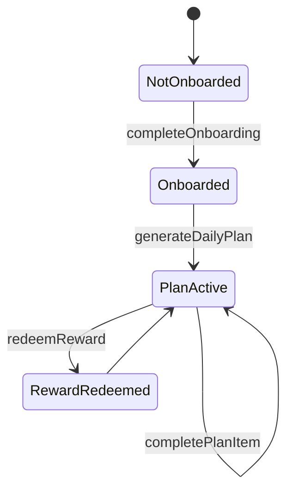

# HabitQuest - Domain Model

## Purpose

The domain must represent the HabitQuest business, not only the current UI. The system models users, goals, activities, daily plans, check-ins, completions, rewards, wallet transactions, and conversation threads.

Core rule:

> The agent guides a manageable day. The wallet records the balance between positive actions and personal rewards.

## Entities

### Profile

Represents a HabitQuest user.

Suggested fields:

- `id`
- `user_id` - Supabase Auth reference
- `display_name`
- `timezone`
- `coach_tone` - collaborative by default
- `created_at`
- `updated_at`

### Goal

A wellbeing goal selected by the user.

Suggested fields:

- `id`
- `profile_id`
- `name`
- `description`
- `status` - `active`, `paused`, `archived`
- `created_at`

Examples: improve focus, sleep better, reduce stress, use screens less, move more.

### ActivityTemplate

Base activity the app can suggest.

Suggested fields:

- `id`
- `name`
- `description`
- `category`
- `default_duration_minutes`
- `default_points`
- `kind` - `positive` or `reward_support`
- `icon`
- `is_system`

### UserActivity

A user-specific activity, either adopted from a template or created manually.

Suggested fields:

- `id`
- `profile_id`
- `activity_template_id` - optional
- `name`
- `description`
- `category`
- `duration_minutes`
- `points`
- `status` - `active`, `paused`, `archived`
- `created_at`

### Reward

A personal reward the user wants to unlock.

Suggested fields:

- `id`
- `profile_id`
- `name`
- `description`
- `category`
- `cost_points`
- `duration_minutes`
- `status` - `active`, `paused`, `archived`
- `created_at`

Examples: 30 min gaming, sweet snack, one episode, small purchase.

### DailyPlan

A plan for one date.

Suggested fields:

- `id`
- `profile_id`
- `date`
- `status` - `draft`, `active`, `completed`, `archived`
- `agent_summary`
- `created_from` - `on_demand`, `check_in_adjustment`, `manual`
- `created_at`
- `updated_at`

### DailyPlanItem

An activity inside a daily plan.

Suggested fields:

- `id`
- `daily_plan_id`
- `user_activity_id`
- `title`
- `duration_minutes`
- `points`
- `position`
- `status` - `pending`, `completed`, `skipped`, `replaced`
- `rationale`
- `completed_at`

Important rule: no mandatory `start_time`. HabitQuest plans by duration and intent, not rigid calendar slots.

### CheckIn

A message or state reported by the user during the day.

Suggested fields:

- `id`
- `profile_id`
- `daily_plan_id`
- `source` - `web`, `telegram`, `whatsapp`, `other`
- `message`
- `energy_level` - optional, 1 to 5
- `stress_level` - optional, 1 to 5
- `intent` - `progress`, `fatigue`, `replan`, `reward_request`, `reflection`, `other`
- `created_at`

### Completion

A completed activity record.

Suggested fields:

- `id`
- `profile_id`
- `daily_plan_item_id` - optional
- `user_activity_id` - optional
- `source`
- `duration_minutes`
- `points_awarded`
- `note`
- `completed_at`

### WalletTransaction

A points movement.

Suggested fields:

- `id`
- `profile_id`
- `type` - `earn`, `redeem`, `adjustment`
- `points`
- `reason`
- `completion_id` - optional
- `reward_id` - optional
- `created_at`

Available balance:

```text
sum(earn.points) - sum(redeem.points) + sum(adjustment.points)
```

### ConversationThread

Link between an external conversation and a profile.

Suggested fields:

- `id`
- `profile_id`
- `channel` - `web`, `telegram`, `whatsapp`, `slack`, etc.
- `external_thread_id`
- `external_user_id`
- `last_message_at`
- `state`
- `created_at`

## Business rules

### Points

- Completing a positive activity creates a `Completion` and a `WalletTransaction` of type `earn`.
- Redeeming a reward creates a `WalletTransaction` of type `redeem`.
- Transactions are append-only for normal flows; corrections use adjustments.
- The standard flow should not allow negative balance.

### Rewards

- If enough points exist, the agent can redeem the reward.
- If points are missing, the agent proposes a short activity to unlock it.
- The language must avoid guilt or punishment.

### Daily plan

- A user has at most one active plan per date.
- The plan contains activities with duration and suggested order.
- The plan can be adjusted by check-ins.
- Adjustments should preserve history using `replaced` or `skipped` items.

### Check-ins

- A check-in can complete work, request replanning, request a reward, or log state.
- The agent uses check-ins to adapt the plan, not to judge the user.

## Agent tools

### completeOnboarding

Persists profile, goals, starting activities, and personal rewards.

### generateDailyPlan

Creates or updates today's plan using goals, available time, and declared state.

### logCheckIn

Stores a check-in and classifies intent.

### completePlanItem

Marks a plan item as completed and awards points.

### redeemReward

Redeems a reward if the user has enough points, or returns alternatives to unlock it.

### getTodaySummary

Returns plan, progress, wallet, and available rewards.

### updatePreferences

Updates goals, activities, rewards, or coach tone.

## MVP state flow


