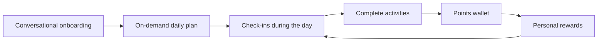

# HabitQuest - Product Vision

## Elevator pitch

HabitQuest is a conversational coach for behavioral wellbeing. It helps people turn intention into daily action: define goals, create a realistic plan without rigid schedules, follow up during the day with check-ins, and unlock personal rewards through a points wallet.

This is not a classic habit tracker. The agent is the core product. The web dashboard is a companion surface for review, editing, and visibility.

## Problem

Many people want to take care of their day, focus better, rest better, reduce impulsive behavior, and still enjoy personal rewards. The issue is not only willpower. The issue is usually the system:

- vague goals;
- oversized plans;
- rewards without awareness;
- no adaptation when energy, stress, or time changes;
- tracking split across notes, apps, and chat.

## Target user

The MVP targets general wellbeing: people who want to manage their day better, do more positive activities, moderate avoidable patterns, and enjoy rewards in a more conscious way.

The MVP does not target a clinical niche. That keeps the demo broad, understandable, and responsible.

## Value proposition

HabitQuest helps the user answer three questions every day:

1. What can I do today that helps me feel better?
2. What personal reward do I want to enjoy without losing control?
3. How do I adapt the plan when the day changes?

MVP promise:

> Talk to HabitQuest, create a realistic daily plan, complete positive activities, and unlock personal rewards with earned points.

## Core loop

## Experience pillars

### Conversational onboarding

The agent learns:

- wellbeing goals;
- activities the user wants to do more often;
- patterns the user wants to avoid or moderate;
- approximate available time;
- desired personal rewards;
- preferred coach tone.

### Daily plan without fixed schedules

The plan includes activities with duration and suggested order, but no required time blocks.

Example:

- Walk outside - 15 min - +20 pts
- Meditate - 10 min - +25 pts
- Read - 20 min - +15 pts
- Clean workspace - 10 min - +10 pts

### Check-ins and adaptation

The user can say:

- "I already walked."
- "I am tired."
- "I have less time now."
- "I want a reward."
- "Adjust my plan."

The agent logs progress, updates expectations, and proposes realistic alternatives.

### Flexible wallet

Positive activities earn points. Personal rewards spend points. If the user does not have enough points, the agent does not punish them. It explains what is missing and proposes a small action to unlock the reward.

### Companion dashboard

The dashboard is used to:

- see today's plan;
- review progress;
- see earned, spent, and available points;
- edit activities and rewards;
- review simple history.

## UX principles

- Collaborative coach, not boss.
- Behavioral wellbeing, not medical promise.
- Small actionable steps over perfect plans.
- Rewards without guilt.
- Conversation first.
- Explain why the agent suggests an activity or reward.

## What we do not promise

HabitQuest does not promise:

- medical diagnosis;
- mental health treatment;
- guaranteed hormone regulation;
- clinical cortisol reduction;
- measurable dopamine increase;
- replacement for therapy, medicine, or professional care.

Use language around wellbeing, habits, planning, focus, energy, rest, and conscious rewards.

## Demo story

1. User opens chat and says: "I want to organize my day better."
2. The agent runs a short onboarding.
3. The user asks for today's plan.
4. The agent proposes 4 activities with duration and points.
5. The user completes an activity by chat.
6. The dashboard shows points and progress.
7. The user asks for a reward.
8. The agent allows redemption or proposes how to unlock it.
